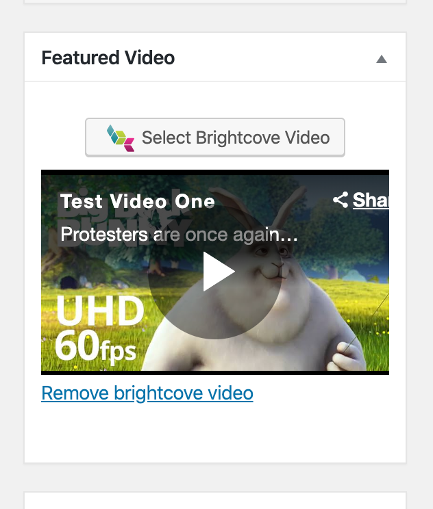
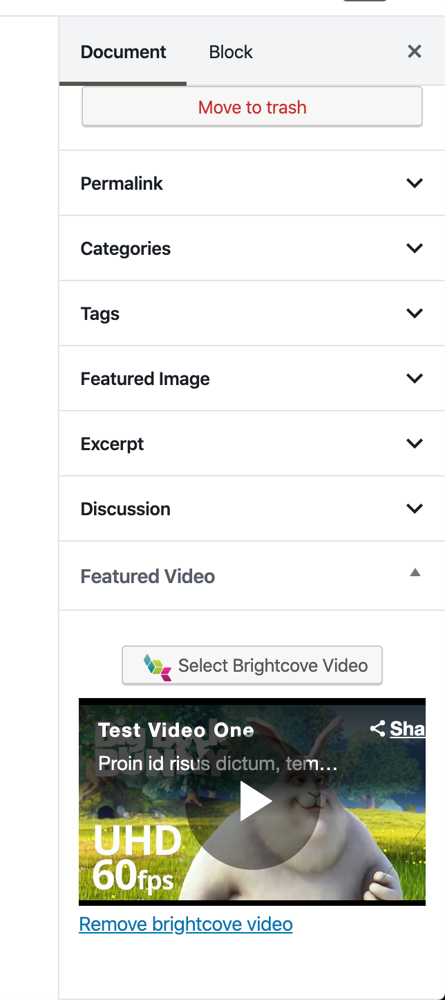

CMB2 Brightcove Video Field
======================

[](https://travis-ci.org/rahulsprajapati/cmb2-brightcove-video-field/) [](https://scrutinizer-ci.com/g/rahulsprajapati/cmb2-brightcove-video-field/?branch=master) [](https://scrutinizer-ci.com/g/rahulsprajapati/cmb2-brightcove-video-field/?branch=master)

Custom field for CMB2 which allow to add brightcove video as featured video ( metabox ).
Adds a new button `Select Brightcove Video` that opens brightcove modal to select video and on save post it stores following data as serialized.

| Data | Meta Key |
|---|---|
| Video ID | bc_video_id |
| Video Duration | bc_video_duration |
| Player ID | bc_player_id |
| Account ID | bc_account_id |

## Required/Dependency Plugins
1. [CMB2](https://github.com/CMB2/CMB2)
2. [Brightcove Video Connect](https://github.com/10up/brightcove-video-connect/)

## Example

```php
// Classic CMB2 declaration.
$cmb = new_cmb2_box( [
    'id'           => 'prefix-metabox-id',
    'title'        => __( 'Featured Video', 'text-domain' ),
    'object_types' => [ 'post' ],
    'context'      => 'side',
    'priority'     => 'high',
    'show_names'   => false,
] );

$cmb->add_field( [
    'name' => __( 'Brightcove Video', 'text-domain' ),
    'id'   => 'brightcove_featured_video',
    'type' => 'brightcove_video',
] );
```

Serialized Saved Data:
```
meta_key: brightcove_featured_video
meta_value: [
    'bc_video_id' => '1236242437001',
    'bc_video_duration' => '2:29',
    'bc_player_id' => '61hrf3oYj',
    'bc_account_id' => '8926567543001' 
]
```

## Screenshots

1. Classic Editor Metabox  

`

2. Gutenberg Metabox

`
